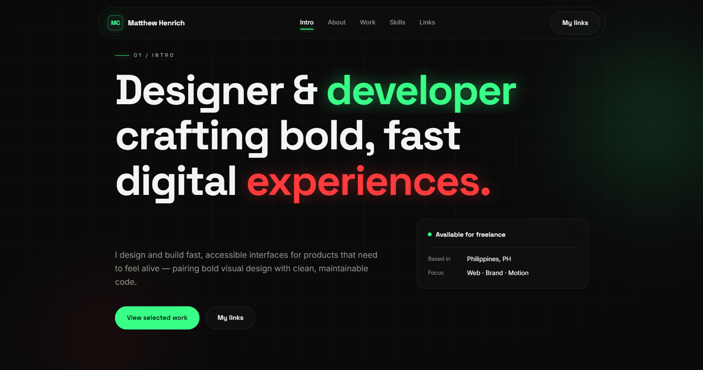

# Matthew Henrich — Portfolio



Personal portfolio site for Matthew Henrich — designer & developer. A dark, bold, single-page site built.

## Features

- Fixed glass navbar with scroll-spy highlighting and an animated mobile menu
- Hero with staggered headline, glass status card, an
- Skills section with toolbox chips — no fake percentage bars
- Link cards for GitHub, LinkedIn, and X
- Scroll-entrance reveals via `IntersectionObserver`
- Footer year and the years-of-experience counter update automatically

## Project structure

```
├── index.html               # single-page site
├── css/
│   └── styles.css           # all styles (design tokens at the top)
├── js/
│   ├── script.js            # nav, reveals, footer year, experience counter
│   └── portfolio.js         # dynamic project grid from portfolio-links.txt
├── links/
│   ├── portfolio-links.txt  # project URLs (data source for the grid)
│   └── social-links.txt     # GitHub / LinkedIn / X
├── projects/                # project thumbnails
└── images/                  # assets (e.g. the README screenshot)
```

## Customizing

- **Colors / fonts / radii** — edit the `:root` design tokens at the top of
  `css/styles.css` (green/red accents, Space Grotesk + Inter).
- **Copy** — hero, about, and skills text lives in `index.html`.
- **Social links** — link cards are in `index.html`;
  `links/social-links.txt` mirrors them.
- **Years of experience** — set `START_YEAR` in `js/script.js`; the counter
  auto-increments every year.

## Tech

Vanilla HTML5, CSS3 (Grid, custom properties, backdrop-filter), and
JavaScript (ES6+, IntersectionObserver). No frameworks, no dependencies.
